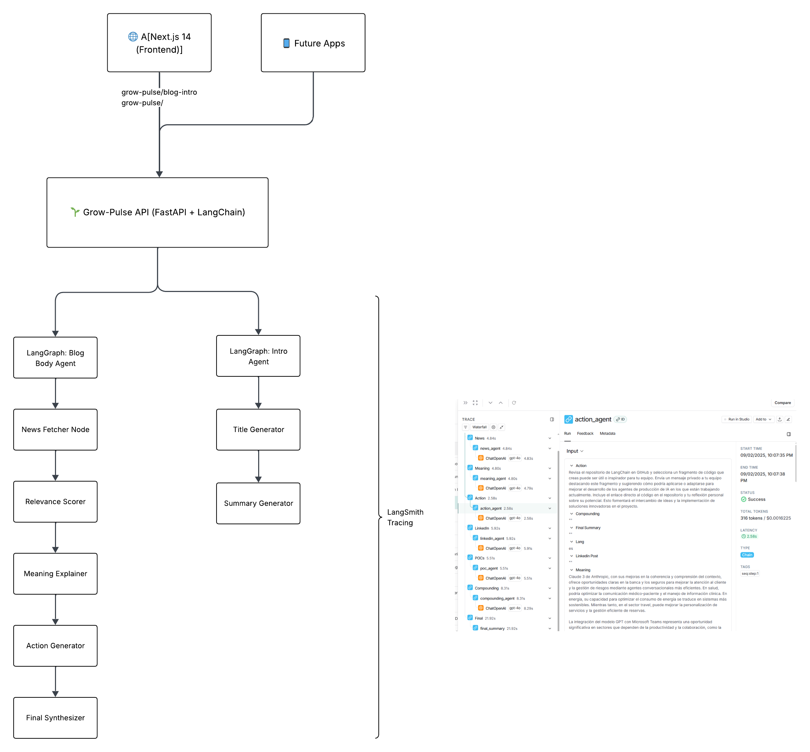

# 🌱 Grow‑Pulse Backend — README (v0.5)

_Subproduct of **GrowRoutine**_

Grow‑Pulse is more than just code – it’s a **daily learning engine** designed to empower ambitious professionals.  
It transforms the overwhelming flood of daily news into **clear opportunities, micro‑actions, and public visibility**.

This project is also an experiment in **personal scalability**: building a product that feels like an entire editorial + coaching team, powered by **one person + AI agents**.  
It reflects the core mission of GrowRoutine: **help people grow 1% every day, consistently and visibly, to reach top‑tier opportunities**.

Grow‑Pulse delivers daily insights as structured JSON that can be consumed by any frontend (Next.js, mobile apps, dashboards).  
It is intentionally built lean, modular, and agent‑first – to explore how far a single individual can go when amplified by AI.

---

## 🗺️ GrowPulse Architecture

<p align="center">
  
</p>

---

## 🗺️ How Grow‑Pulse Agent Works?

The **Grow‑Pulse Agent** is an **orchestrated pipeline of LLM‑based nodes** built with LangGraph.  
It processes a simple request (task, language, profession, sector) and returns a full **daily growth briefing**.

### 1. **News Agent**
- Role: Acts as an **AI analyst**.  
- Task: Extracts 3–5 **recent AI news items** (OpenAI, Anthropic, DeepMind, open‑source, enterprise).  
- Output: Concise, concrete, non‑fabricated headlines.

### 2. **Meaning Agent**
- Role: **Career coach**.  
- Task: Explains how each news item becomes an **opportunity** for the given profession/sector.  
- Output: Domain‑tailored opportunities (finance, healthcare, travel, energy, etc.).

### 3. **Action Agent**
- Role: **Execution coach**.  
- Task: Proposes **one micro‑action (≤15 min)** that can be done today (post, DM, repo test, pitch).  
- Output: Actionable next step.

### 4. **LinkedIn Agent**
- Role: **Content strategist**.  
- Task: Generates **two LinkedIn posts** (English + Spanish), designed to attract **high‑value inbound leads (+10K/month)**.  
- Output: Posts ready to be published.

### 5. **POC Agent**
- Role: **Prototype ideator**.  
- Task: Suggests **3 quick POC ideas (≤45 min)** based on the news + context.  
- Output: Lightweight experiments to validate ideas.

### 6. **Compounding Agent**
- Role: **Strategist**.  
- Task: Explains how posts, actions, and POCs **compound into long‑term global opportunities**.  
- Output: Strategic narrative for consistency & leverage.

### 7. **Final Summary**
- Role: **Synthesizer**.  
- Task: Combines all outputs into a **clear, structured summary**.  
- Output: JSON + human‑readable overview of the daily briefing.

---

## 🧠 What Kind of Agent Is This?

- **Type**: 🚀 **Multi‑stage Orchestrator Agent** (Pipeline Agent)  
- **Framework**: Built with **LangGraph** + **LangChain**.  
- **Pattern**: Deterministic, sequential execution of specialized sub‑agents.  
- **Purpose**: Transform news → insights → action → visibility → strategy.  
- **Unique Angle**: Designed for **career leverage and personal scalability**, not just information digestion.

---

## 📂 Pipeline Overview

**Flow:**

`Input (task, lang, profession, sector)` →  
`News → Meaning → Action → LinkedIn → POCs → Compounding → Final Summary` →  
`Output JSON`

---

## 🚀 Deployment Guide (WIP)

### 1. EC2 Server (AWS)
- Launch **Ubuntu 24.04** EC2 instance.  
- Security Groups:  
  - 22 (SSH) – access for you only.  
  - 80 (HTTP), 443 (HTTPS) – for serving the app.  
- This instance is where the backend service lives.

### 2. Environment Setup
```bash
sudo apt update && sudo apt upgrade -y
sudo apt install -y python3.12 python3.12-venv python3-pip git build-essential
```
- Create project folder: `/srv/growroutine/backend`  
- Clone repo into it.  
- Create venv: `python3.12 -m venv .venv`  
- Activate: `source .venv/bin/activate`  
- Install dependencies: `pip install -r requirements.txt`  

### 3. Environment Variables
File: `/etc/growroutine/backend.env`  
```
ENV=production
HOST=127.0.0.1
PORT=8000
ALLOWED_ORIGINS=https://growroutine.com
```

### 4. Run Backend (FastAPI)
- Entry point: `api.main:app`  
- Add `/healthz` endpoint.  
- Enable CORS for `https://growroutine.com`.

### 5. Systemd Service
File: `/etc/systemd/system/growroutine-backend.service`  
```
[Unit]
Description=GrowRoutine Backend Service
After=network.target

[Service]
User=ubuntu
Group=ubuntu
WorkingDirectory=/srv/growroutine/backend
EnvironmentFile=/etc/growroutine/backend.env
ExecStart=/srv/growroutine/backend/.venv/bin/gunicorn api.main:app   --bind 127.0.0.1:8000   --workers 2   --worker-class uvicorn.workers.UvicornWorker   --timeout 120
Restart=always

[Install]
WantedBy=multi-user.target
```

### 6. Nginx Reverse Proxy
Inside HTTPS server block:  
```
location /api/ {
  proxy_pass http://127.0.0.1:8000/;
  proxy_set_header Host $host;
  proxy_set_header X-Forwarded-For $proxy_add_x_forwarded_for;
  proxy_read_timeout 180s;
}
```

Now API is accessible under `https://growroutine.com/api/...`.

### 7. Final Checks (WIP)
```bash
systemctl status growroutine-backend
curl http://127.0.0.1:8000/healthz
curl https://growroutine.com/api/healthz
```

✅ Backend is now running as a production service, behind HTTPS.

---

## 📄 License
MIT (tbd).
