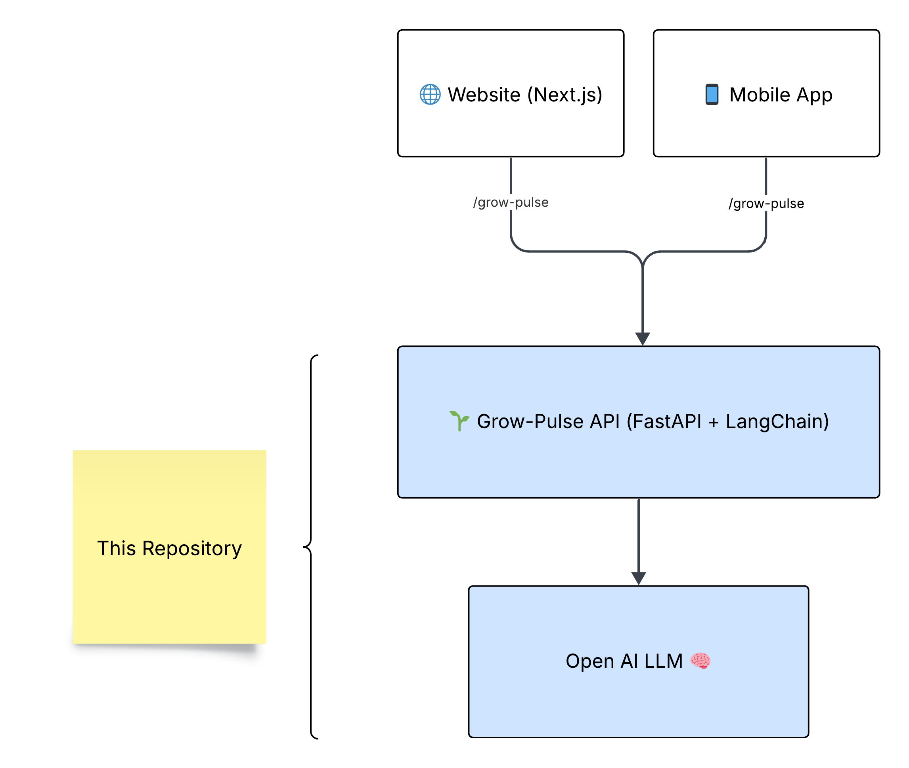

# 🌱 Grow‑Pulse Backend — README (v0.4)

_Subproduct of **GrowRoutine**_

Grow‑Pulse is more than just code – it’s a **daily learning engine** designed to empower ambitious professionals.  
It transforms the overwhelming flood of daily news into **clear opportunities, micro‑actions, and public visibility**.

This project is also an experiment in **personal scalability**: building a product that feels like an entire editorial + coaching team, powered by **one person + AI agents**.  
It reflects the core mission of GrowRoutine: **help people grow 1% every day, consistently and visibly, to reach top‑tier opportunities**.

Grow‑Pulse delivers daily insights as structured JSON that can be consumed by any frontend (Next.js, mobile apps, dashboards).  
It is intentionally built lean, modular, and agent‑first – to explore how far a single individual can go when amplified by AI.

---

## 🗺️ GrowPulse Architecture

  

---

## 🗺️ How Grow‑Pulse Agent Works?

The **Grow‑Pulse Agent** is an **orchestrated pipeline of LLM‑based nodes** built with LangGraph.  
It processes a simple request (task, language, profession, sector) and returns a full **daily growth briefing**.

### 1. **News Agent**
- Role: Acts as an **AI analyst**.  
- Task: Extracts 3–5 **recent AI news items** (OpenAI, Anthropic, DeepMind, open‑source, enterprise).  
- Output: Concise, concrete, non‑fabricated headlines.

### 2. **Meaning Agent**
- Role: **Career coach**.  
- Task: Explains how each news item becomes an **opportunity** for the given profession/sector.  
- Output: Domain‑tailored opportunities (finance, healthcare, travel, energy, etc.).

### 3. **Action Agent**
- Role: **Execution coach**.  
- Task: Proposes **one micro‑action (≤15 min)** that can be done today (post, DM, repo test, pitch).  
- Output: Actionable next step.

### 4. **LinkedIn Agent**
- Role: **Content strategist**.  
- Task: Generates **two LinkedIn posts** (English + Spanish), designed to attract **high‑value inbound leads (+10K/month)**.  
- Output: Posts ready to be published.

### 5. **POC Agent**
- Role: **Prototype ideator**.  
- Task: Suggests **3 quick POC ideas (≤45 min)** based on the news + context.  
- Output: Lightweight experiments to validate ideas.

### 6. **Compounding Agent**
- Role: **Strategist**.  
- Task: Explains how posts, actions, and POCs **compound into long‑term global opportunities**.  
- Output: Strategic narrative for consistency & leverage.

### 7. **Final Summary**
- Role: **Synthesizer**.  
- Task: Combines all outputs into a **clear, structured summary**.  
- Output: JSON + human‑readable overview of the daily briefing.

---

## 🧠 What Kind of Agent Is This?

- **Type**: 🚀 **Multi‑stage Orchestrator Agent** (Pipeline Agent)  
- **Framework**: Built with **LangGraph** + **LangChain**.  
- **Pattern**: Deterministic, sequential execution of specialized sub‑agents.  
- **Purpose**: Transform news → insights → action → visibility → strategy.  
- **Unique Angle**: Designed for **career leverage and personal scalability**, not just information digestion.

---

## 📂 Pipeline Overview

**Flow:**

`Input (task, lang, profession, sector)` →  
`News → Meaning → Action → LinkedIn → POCs → Compounding → Final Summary` →  
`Output JSON`

---

## 📄 License
MIT (tbd).
